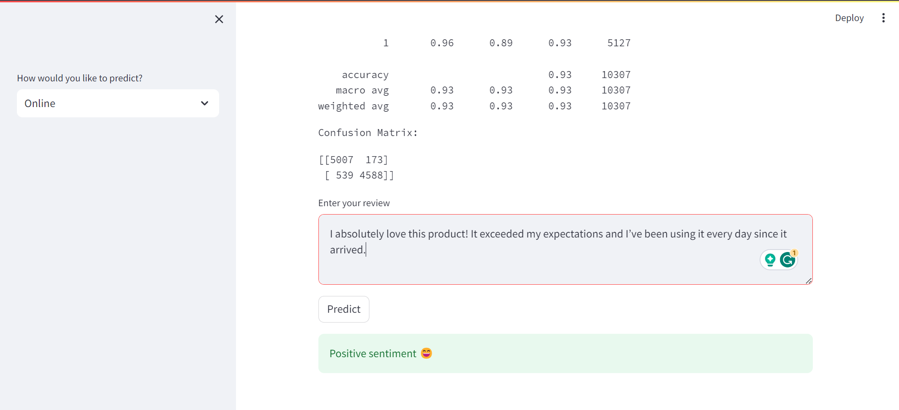
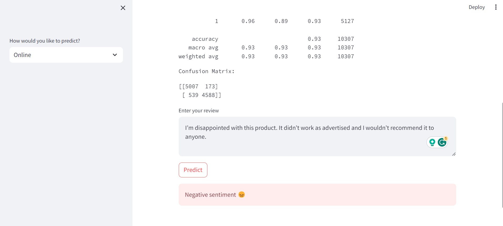
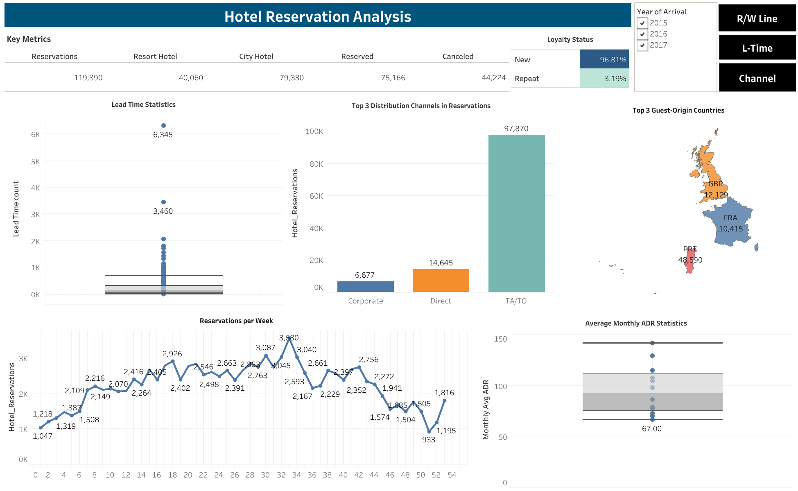
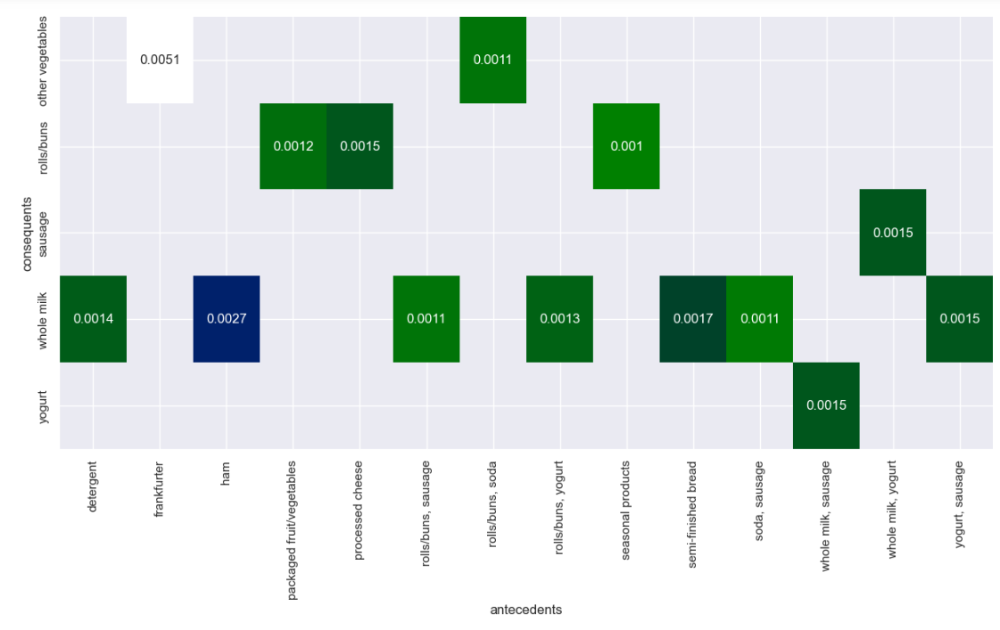
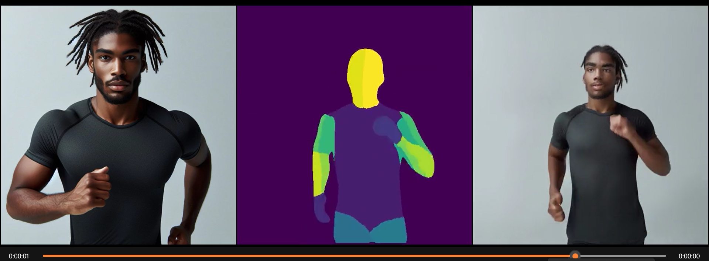

# **DATA SCIENCE/ANALYTICS & AI PORTFOLIO**

---

# **APPRENTICESHIP PROJECTS**

## [Sentiment Analysis for Product Reviews](https://github.com/Annet-Chebukati/Flit_inc_Apprenticeship/tree/master/DataScienceandAIprojects/Sentiment_Analysis_for_Product_Reviews)

[**PRESENTATION**](https://github.com/Annet-Chebukati/Flit_inc_Apprenticeship/blob/master/DataScienceandAIprojects/Sentiment_Analysis_for_Product_Reviews/Sentiment%20Analysis%20Presentation.pdf) [**JUPYTER NOTEBOOK**](https://github.com/Annet-Chebukati/Flit_inc_Apprenticeship/blob/master/DataScienceandAIprojects/Sentiment_Analysis_for_Product_Reviews/Sentiment%20Analysis.ipynb)

Streamlit App Screenshot - **P0SITIVE REVIEW**

Streamlit App Screenshot - **NEGATIVE REVIEW**

### Overview
In this project, I conducted sentiment analysis on a collection of product reviews from an e-commerce platform. Utilizing a combination of text reviews and associated ratings, I developed a model capable of classifying the sentiment of each review as positive, negative, or neutral. The project leveraged natural language processing techniques and machine learning to analyze and categorize sentiments, providing valuable insights into customer feedback.

### Tools and Technologies
- **Python Libraries**: Utilized for data manipulation and analysis (Pandas, NLTK).
- **Machine Learning Libraries**: Employed for building and evaluating the sentiment analysis model (Scikit-learn, Spacy).
- **Jupyter Notebook**: The primary platform for documenting the analysis process.
- **GitHub**: Used for version control and sharing the project's codebase.
- **Streamlit**: Enabled the creation of an interactive web application to showcase the analysis results.

### Process and Methodology
1. **Data Preparation**: I began by importing the dataset into an SQL environment, ensuring the data was clean and structured for analysis.
2. **Exploratory Data Analysis (EDA)**: I conducted an initial exploration to understand the data's characteristics and identify any patterns.
3. **Data Preprocessing**: The text data was cleaned and preprocessed to ensure it was in the optimal format for modeling.
4. **Sentiment Labeling**: Each review was labeled according to sentiment derived from the text content and associated ratings.
5. **Text Vectorization**: I transformed the text data into a numerical format that machine learning models could interpret.
6. **Model Building**: A machine learning model was constructed to classify the reviews' sentiments accurately.
7. **Model Evaluation**: The model's performance was rigorously assessed using appropriate evaluation metrics.
8. **Sentiment Analysis Dashboard**: An interactive dashboard was created using Streamlit to visualize and interact with the sentiment analysis results.

## [Hotel Reservation Analysis in SQL and Tableau](https://github.com/Annet-Chebukati/Flit_inc_Apprenticeship/tree/master/DataScienceandAIprojects/Hotel_Reservation_Analysis)

[**TABLEAU DASHBOARD**](https://public.tableau.com/views/Hotel_Reservation_Analysis/Dashboard?:language=en-US&:display_count=n&:origin=viz_share_link) [**PRESENTATION**](https://github.com/Annet-Chebukati/Flit_inc_Apprenticeship/blob/master/DataScienceandAIprojects/Hotel_Reservation_Analysis/Hotel_Reservation_Analysis_Presentation.pdf) [**SQL SCRIPT**](https://github.com/Annet-Chebukati/Flit_inc_Apprenticeship/blob/master/DataScienceandAIprojects/Hotel_Reservation_Analysis/SQL/SQLcode.sql)

### Objective
The goal of this project is to work with a hotel reservation dataset that contains information about reservations at two types of hotels: Resort Hotels (H1) and City Hotels (H2). I used SQL for data manipulation and Tableau for visualization to gain insights and create impactful visualizations.

### Tools
- SQL (MySQL, PostgreSQL, BigQuery, Athena)
- Tableau
- GitHub

### Steps
1. **Data Import:**
   - Import the hotel reservation dataset into your preferred SQL environment.
2. **Data Exploration:**
   - Explore the dataset to understand the variables and the relationships between them.
3. **SQL Analysis:**
   - Use SQL for data manipulation and analysis.
4. **Tableau Visualization:**
   - Create visualizations in Tableau based on my findings from the SQL analysis.
5. **GitHub Repository:**
   - Maintain a GitHub repository with all my scripts, code, and visualizations.
6. **Tableau Dashboards publishing:**
   - Publish my Tableau dashboards for easy access and sharing.
7. **Presentation:**
   - Prepare a presentation or report summarizing my findings and recommendations.

## [Market Basket Analysis for E-commerce](https://github.com/Annet-Chebukati/Flit_inc_Apprenticeship/tree/master/DataScienceandAIprojects/Market_Basket_Analysis)

[**JUPYTER NOTEBOOK**](https://github.com/Annet-Chebukati/Flit_inc_Apprenticeship/blob/master/DataScienceandAIprojects/Market_Basket_Analysis/Market%20Basket%20Analysis%20in%20Python.ipynb) [**PRESENTATION**](https://github.com/Annet-Chebukati/Flit_inc_Apprenticeship/blob/master/DataScienceandAIprojects/Market_Basket_Analysis/Market_Basket_Analysis_Presentation.pdf)

### Objective
In this project, I conducted a market basket analysis, for retail and e-commerce. I extracted valuable insights from transaction data, to understand customer purchasing behavior, and use this knowledge for business optimization.

### Tools
- Data Analysis Tool: Python (using libraries like Pandas, etc.)
- Data Visualization Tool: Matplotlib, Seaborn
- Scikit-Learn
- Jupyter NotebookTools

### Steps
1. **Data Preparation:**
   - Load the dataset using pandas.
   - Clean the data by handling missing values and removing duplicates.
- Preprocess the data if necessary, such as converting data types, encoding categorical variables, etc.
2. **Exploratory Data Analysis (EDA):**
  - Analyze the dataset to understand the distribution and relationship of the variables.
  - Use visualization tools like Matplotlib and Seaborn to create plots for better understanding.
3. **Market Basket Analysis:**
    - Use the Apriori algorithm or other association rule mining algorithms for market basket analysis.
    - Generate frequent itemsets and strong association rules.
4. **Visualization:**
    - Visualize the results of the market basket analysis.
    - Create plots to show the most frequent itemsets, the items that are most commonly bought together, etc.
5. **Interpretation and Insights:**
    - Interpret the results of the market basket analysis.
    - Extract insights about customer purchasing behavior.
6. **Recommendations:**
    - Based on the insights, make recommendations for business optimization.
    - Suggestions could include changes in product placement, pricing strategies, cross-selling tactics, etc.
7. **Presentation:**
    - Document all my findings, code, and visualizations in a Jupyter Notebook.
    - Prepare a presentation or report for my mentorship group

---

# **CLASS PROJECTS**

## [Car Price Prediction using Linear Regression: Project Overview](https://github.com/Annet-Chebukati/Annet_Portfolio/blob/main/%20Car%20Price%20Prediction%20-%20Linear%20Regression.ipynb)

In this project, I utilized a linear regression model to predict car prices and further explored the methods used to interpret and evaluate the results of our model. The project involved the following steps:
- **Data Assessment**: The initial step involved a thorough assessment of the data to understand its structure and content.
- **Building Models**: I built a basic linear regression model using selected features and ran the model summary. I also constructed a full linear regression model using a comprehensive range of features available.
- **Feature Engineering**: I plotted a correlation matrix and reduced the number of independent variables through feature engineering. I also performed one-hot encoding on categorical variables.
- **Model Training and Prediction**: I split the data into train and test sets, fitted the model to the training data, and performed predictions on the test set.
- **Model Refinement**: I printed the summary output of the model, selected variables that were statistically significant (p-value < 0.05), and retrained the model.
- **Scaling Variables**: I scaled the independent variables and fitted the model with the standardized data.
- **Model Evaluation**: Finally, I evaluated the performance of the Linear Regression model.

## [Predicting Credit Card Approval - Classification Model: Project Overview](https://github.com/Annet-Chebukati/Annet_Portfolio/blob/main/Predicting%20Credit%20Card%20Approval%20-%20Classification.ipynb)

In this project, I developed an automatic credit card approval predictor using machine learning classification techniques. The project involved the following steps:
- **Data Loading**: The initial step involved loading and viewing the dataset.
- **Data Preprocessing**: The dataset contained a mixture of numerical and non-numerical features, values from different ranges, and several missing entries. I preprocessed the dataset to ensure the machine learning model could make good predictions.
- **Exploratory Data Analysis**: After the data was in good shape, I performed some exploratory data analysis to build my intuitions.
- **Model Building**: Finally, I built a machine learning classification model that predicts if an individual's application for a credit card will be accepted.

## [Google Play Store Apps and Reviews: Project Overview](https://github.com/Annet-Chebukati/Annet_Portfolio/blob/main/Google%20Play%20Store%20apps%20and%20reviews.ipynb)

In this project, I conducted a comprehensive analysis of the Android app market by comparing over ten thousand apps in Google Play across different categories. The project involved the following steps:
- **Data Analysis**: I analyzed the Android app market, looking for insights into the data to devise strategies to drive growth and retention.
- **Comparison**: I compared over ten thousand apps in Google Play across different categories to understand the market dynamics.
- **Insights**: I looked for insights into the data to devise strategies to drive growth and retention.

## [A Visual History Of Nobel Price Winners: Project Overview](https://github.com/Annet-Chebukati/Annet_Portfolio/blob/main/A%20visual%20History%20of%20Nobel%20Price%20Winners.ipynb)

In this project, I conducted an exploratory data analysis on the Nobel prize winners' dataset spanning from 1901 to 2016. The project involved the following steps:
- **Data Analysis**: I performed an exploratory data analysis on the Nobel prize winners' dataset, looking for patterns, trends, and insights.
- **Insights Extraction**: I extracted insights from the dataset, focusing on the distribution of prizes across different categories, countries, and over time.
- **Data Visualization**: I visualized the data to better understand the patterns and trends observed.

## [Analyze International Debt Statistics - SQL: Project Overview](https://github.com/Annet-Chebukati/Annet_Portfolio/blob/main/Analyze%20International%20Debt%20Statistics.ipynb)

In this project, I analyzed international debt data collected by The World Bank. The dataset contains information about the amount of debt (in USD) owed by developing countries across several categories. The project aimed to answer the following questions:
- **Total Debt**: What is the total debt owed by the countries listed in the dataset?
- **Maximum Debt**: Which country owns the maximum amount of debt and what is that amount?
- **Average Debt**: What is the average amount of debt owed by countries across different debt indicators?

## [Analyze NYC Public School Test Results Score - SQL: Project Overview](https://github.com/Annet-Chebukati/Annet_Portfolio/blob/main/Analyzing%20NYC%20Public%20School%20Test%20Result%20Scores.ipynb)

In this project, I conducted a comprehensive analysis of data on SATs across public schools in New York City. The project involved the following steps:
- **Data Analysis**: I performed an exploratory data analysis on the SATs dataset, looking for patterns, trends, and insights.
- **Insights Extraction**: I extracted insights from the dataset, focusing on the distribution of scores across different schools, districts, and over time.
- **Data Visualization**: I visualized the data to better understand the patterns and trends observed.

---

# **PASSION PROJECTS - APPLIED AI**

## [Human Image Animation with Diffusion Models](https://github.com/Annet-Chebukati/ALX_AppliedAI/tree/master/Human_Image_Animation)

[**OUTPUT VIDEO**](https://youtu.be/w8b87GyMjWE) [**MAGICANIMATE**](https://github.com/Annet-Chebukati/ALX_AppliedAI/blob/master/Human_Image_Animation/MagicAnimate_002.ipynb) [**VIDEO2DENSEPOSE**](https://github.com/Annet-Chebukati/ALX_AppliedAI/blob/master/Human_Image_Animation/Vid2Densepose.ipynb)

### Introduction
Welcome to my journey of bringing imagination to life with human image animation. This cutting-edge technology allows us to create realistic and expressive characters in motion, transforming the realm of traditional animation studios. Now, anyone with a creative spark can tell their stories and share their vision with the world, regardless of technical expertise.

### Diffusion Models
At the heart of this revolution lies a powerful tool called a diffusion model. This sophisticated AI algorithm is like a magic paintbrush, capable of transforming simple noise into stunning visuals. Understanding the flow of information can gradually add details and shapes, ultimately breathing life into still images.

### Human Image Animation
Human image animation encompasses various techniques to create the illusion of movement in human figures. These techniques range from traditional frame-by-frame animation to more recent advancements like deep learning and artificial intelligence.

### Project Steps
1. **Setting the Stage**: We need a reference image and a motion sequence. The motion sequence will guide the movement of the character on the reference image when generating the animation.
2. **Generate Motion Sequence with vid2densepos**: Use [vid2densepos](https://github.com/Flode-Labs/vid2densepose?ref=alxappliedai.com) to generate your motion sequence. You can drag and drop your video into the file explorer of your Colab runtime. You can name your file anything but if it is not "input_video.mp4" make sure to change the INPUT_VIDEO_PATH. Click on the play button to install the required libraries and convert the input file into a Densepose file. This file will appear on the file explorer. Once you have done these steps, you can download your output motion sequence Densepose file. We will use this file later.
3. **Running the Magic**: MagicAnimate on Google Colab processes your files faster as you will be using your runtime. However, make sure you are using a very short motion sequence Densepose file (around 5 sec maximum). Once finished, you can access the MagicAnimate web app using the link provided.
4. **Generating the Magic**: Upload the following required files:
    - **Reference Image**: I'll be using an AI-generated image of a person, but you can use any image of your choice. For better results, please use a square image. You can generate such an image for free using several services such as [Bing Image Creator](https://www.bing.com/images/create?FORM=GDPGLP&ref=alxappliedai.com).
    - **Motion Sequence**: Here, you can go ahead and upload your previously generated motion sequence file or you can choose from the already provided example motion sequence files in the web app. If you are using your motion sequence file, I recommend making it with a square aspect ratio. You can use free tools to crop it before or after processing.
    Once you have uploaded the two files, click on "Animate" and wait for the magic to happen!

## [Creating a Deep Fake Video with Refacer](https://github.com/Annet-Chebukati/ALX_AppliedAI/tree/master/Creating_DeepFake-Video)

[**DEEP FAKE VIDEO**](https://youtu.be/0mOdxJeZ0mU) [**GOOGLE COLAB**](https://colab.research.google.com/drive/1gyhEp2WDvFhPJ5YthN2W0XccU700TSJv?usp=sharing&ref=alxappliedai.com)

It's truly amazing to see the transformation! The video link above provides a side-by-side comparison of the original (on the left) and my deepfake version (on the right).

### Introduction
Welcome to the fascinating world of deepfake technology, powered by advancements in AI. While creating unique content has become more accessible, it's crucial to use this technology responsibly. This README guides you through the process of creating a deepfake video using free AI tools. I embarked on this adventure with the captivating trailer of the docuseries 'African Queens' from Netflix, which tells the story of the warrior Queen Njinga of Angola. In a twist of digital magic, I replaced Queen Njinga's face with my own!

### Tool: Refacer
To facilitate the deepfake creation process, I used a tool called Refacer, which you can check out on [GitHub.](https://github.com/xaviviro/refacer?ref=alxappliedai.com) This tool allows you to create deepfakes with multiple faces with just one click! It's powered by the excellent [Insightface](https://intranet.alxswe.com/rltoken/https://github.com/deepinsight/insightface?ref=alxappliedai.com) and inspired by [Roop](https://github.com/s0md3v/roop?ref=alxappliedai.com).

### Accessing Refacer through Google Colab
You can access Refacer through Google Colab by following this link: [`refacer_colab.ipynb`](https://colab.research.google.com/drive/1gyhEp2WDvFhPJ5YthN2W0XccU700TSJv?usp=sharing&ref=alxappliedai.com). To initiate the installation and setup process, click the play button on the Refacer Colab notebook.

## Accessing Refacer Webapp
Upon completion, the program provides a link to access the application used for deep clone creation. This is a temporary link that you can use to access Refacer on the web.

## Using the Refacer Webapp
The Refacer web application comprises four main sections:
1. **Original Video Upload**: Here, you upload the source video.
2. **Target Faces Placement**: In this section, you place the faces in the video that you want to replace. Up to five faces are supported.
3. **Replacement Faces Placement**: Here, you position the faces that will replace the corresponding faces uploaded in the previous section.
4. **Output File Display**: The resulting file will be displayed here.

## Creating the Deepfake
Upload the respective files to their designated sections and click "Reface" (the big orange button at the bottom of the page). This action initiates a process that will "reface" all frames in the video using the provided faces. Please note that this process may take some time.

## Accessing the Output File
The output file is accessible on the Refacer web app. However, if the video does not appear promptly, check the Colab file for a completion message indicating the location of the refaced video. You can access the file explorer to retrieve the refaced video.

---

# **CORE COMPETENCIES**

- **Methodologies**: Data Management, Statistics, Data Visualization, Data Presentation and Communication, Machine Learning, Problem-solving, Research, Collaboration, Financial Analysis, Modeling and Valuation, Business Intelligence, Exploratory Data Analysis, Feature Engineering, Deep Learning, Time Series Analysis, Natural Language Processing.
- **Languages**: Python (Pandas, Numpy, Scikit-Learn, Scipy, TensorFlow, Keras, Seaborn, Plotly, Matplotlib), R, SQL.
- **Tools**: Excel, Power BI, Tableau, BigQuery, Google Data Studio, Power Pivot, Power Query, VBA, Macabacus, Azure

---

# **CERTIFICATES**

- [Certificate of Completion - Bootcamp training in Data Science](https://drive.google.com/file/d/1OpfKnBP4nGYEHx3L1szD-OuL1StPqfq-/view?usp=sharing)
- [Financial Modelling and Valuation Analyst](https://credentials.corporatefinanceinstitute.com/36a1a3b3-f9f8-4f17-9a6e-6dbf281c0762)
- [Business Intelligence & Data Analyst (BIDA)®](https://www.credential.net/86cd0afe-3a47-4238-88a7-5d4341e4f32f)
- [Data Analytics Consulting Virtual Internship](https://forage-uploads-prod.s3.amazonaws.com/completion-certificates/KPMG%20AU/m7W4GMqeT3bh9Nb2c_KPMG%20AU_TSaEu86uhPwkwJE44_1673006055234_completion_certificate.pdf)
- [Badge of completion for the Open-Access Data Science & Advanced Analytics Virtual Experience Program](https://www.theforage.com/badges/TSaEu86uhPwkwJE44/CMuzezzkFsMHPKMi7/Badge%20of%20completion%20for%20the%20Open-Access%20Data%20Science%20&%20Advanced%20Analytics%20Virtual%20Experience%20Program/Annet)
- [Data Scientist with Python Statement of Accomplishment by DataCamp](https://drive.google.com/file/d/1TVF4z9S9yPQyB8UaGezXwe4awJTc2iFk/view?usp=sharing)

---

© 2023 Annet Chebukati. Powered by Jekyll and the Minimal Theme.

