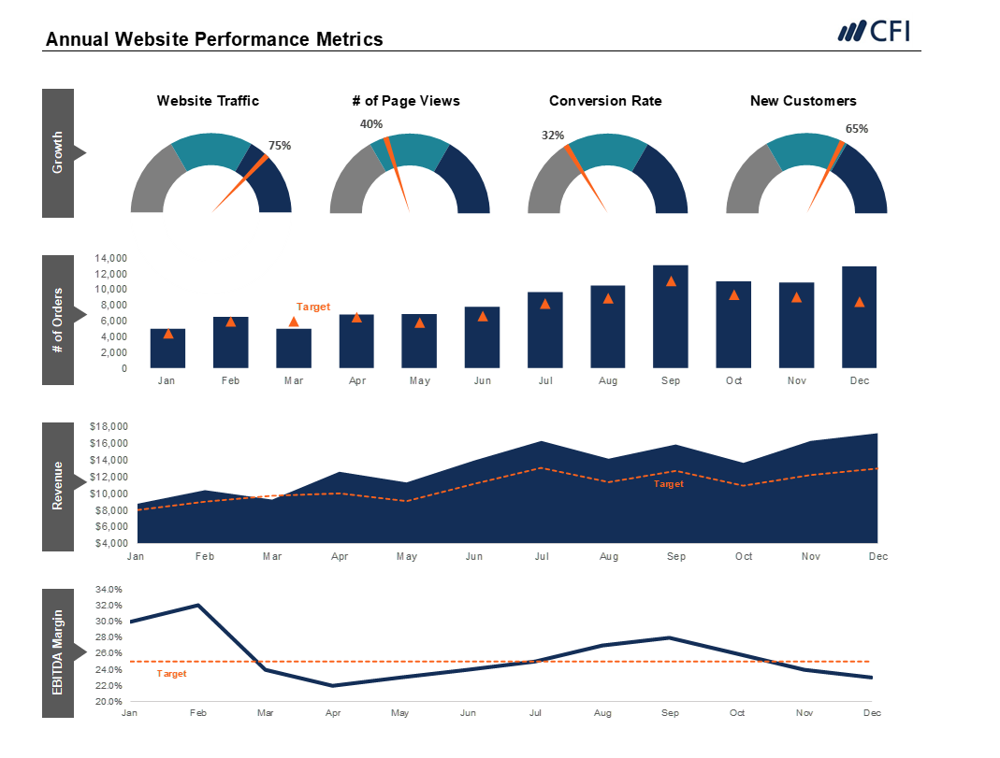

# DATA SCIENCE/ANALYTICS PORTFOLIO

---

## **PYTHON**

## [Car Insurance Analysis with BigQuery, Tableau, and Google Data Studio](https://github.com/Annet-Chebukati/Flit_inc_Apprenticeship/tree/master/DataScienceandAIprojects/Car_Insurance_Analysis)

**Upper Management**

[**📊 TABLEAU DASHBOARD**](https://public.tableau.com/views/CarInsuranceAnalysis_17042135260620/Dashboard?:language=en-US&:display_count=n&:origin=viz_share_link)  ||  [**🎥 PRESENTATION**](https://github.com/Annet-Chebukati/Flit_inc_Apprenticeship/blob/master/DataScienceandAIprojects/Car_Insurance_Analysis/Upper%20Management%20Dashboard%20Presentation.pdf)

**Operational Teams**

[**📊 GOOGLE DATA STUDIO DASHBOARD**](https://lookerstudio.google.com/reporting/14ab11f1-8f88-4602-8319-66aff18c737b)  ||  [**🎥 PRESENTATION**](https://github.com/Annet-Chebukati/Flit_inc_Apprenticeship/blob/master/DataScienceandAIprojects/Car_Insurance_Analysis/Operational%20Dashboard%20Presentation.pdf)

### Overview
In this project, I will analyze a dataset from a Car Insurance company. Utilizing a combination of data analysis and visualization tools, I will develop insightful dashboards designed for insurance analysis. The project caters to two distinct audiences: upper management, who will use Tableau, and operational teams, who will rely on Google Data Studio.

### Tools and Technologies
- Google BigQuery: Used for data storage and querying.
- Tableau: Employed for creating dashboards for upper management.
- Google Data Studio: Utilized for crafting operational dashboards.
- GitHub: The primary platform for version control and sharing the project's codebase.

### Process and Methodology
1. **Data Preparation**: Begin by importing the car insurance dataset into Google BigQuery, ensuring the data is clean and structured for analysis.
2. **Data Analysis**: Conduct an initial exploration to understand the data's characteristics and identify any patterns.
3. **Dashboard Creation**: Create dashboards in Tableau for upper management and another operational dashboard in Google Data Studio.
4. **Presentation**: The findings will be presented to the relevant stakeholders.

## [Sentiment Analysis for Product Reviews](https://github.com/Annet-Chebukati/Flit_inc_Apprenticeship/tree/master/DataScienceandAIprojects/Sentiment_Analysis_for_Product_Reviews)

[**🎥 PRESENTATION**](https://github.com/Annet-Chebukati/Flit_inc_Apprenticeship/blob/master/DataScienceandAIprojects/Sentiment_Analysis_for_Product_Reviews/Sentiment%20Analysis%20Presentation.pdf)  ||  [**📔 JUPYTER NOTEBOOK**](https://github.com/Annet-Chebukati/Flit_inc_Apprenticeship/blob/master/DataScienceandAIprojects/Sentiment_Analysis_for_Product_Reviews/Sentiment%20Analysis.ipynb)

Streamlit App Screenshot - **P0SITIVE REVIEW**

Streamlit App Screenshot - **NEGATIVE REVIEW**

### Overview
In this project, I conducted sentiment analysis on a collection of product reviews from an e-commerce platform. Utilizing a combination of text reviews and associated ratings, I developed a model capable of classifying the sentiment of each review as positive, negative, or neutral. The project leveraged natural language processing techniques and machine learning to analyze and categorize sentiments, providing valuable insights into customer feedback.

### Tools and Technologies
- **Python Libraries**: Utilized for data manipulation and analysis (Pandas, NLTK).
- **Machine Learning Libraries**: Employed for building and evaluating the sentiment analysis model (Scikit-learn, Spacy).
- **Jupyter Notebook**: The primary platform for documenting the analysis process.
- **GitHub**: Used for version control and sharing the project's codebase.
- **Streamlit**: Enabled the creation of an interactive web application to showcase the analysis results.

### Process and Methodology
1. **Data Preparation**: I began by importing the dataset into an SQL environment, ensuring the data was clean and structured for analysis.
2. **Exploratory Data Analysis (EDA)**: I conducted an initial exploration to understand the data's characteristics and identify any patterns.
3. **Data Preprocessing**: The text data was cleaned and preprocessed to ensure it was in the optimal format for modeling.
4. **Sentiment Labeling**: Each review was labeled according to sentiment derived from the text content and associated ratings.
5. **Text Vectorization**: I transformed the text data into a numerical format that machine learning models could interpret.
6. **Model Building**: A machine learning model was constructed to classify the reviews' sentiments accurately.
7. **Model Evaluation**: The model's performance was rigorously assessed using appropriate evaluation metrics.
8. **Sentiment Analysis Dashboard**: An interactive dashboard was created using Streamlit to visualize and interact with the sentiment analysis results.

## [Hotel Reservation Analysis in SQL and Tableau](https://github.com/Annet-Chebukati/Flit_inc_Apprenticeship/tree/master/DataScienceandAIprojects/Hotel_Reservation_Analysis)

[**📊 TABLEAU DASHBOARD**](https://public.tableau.com/views/Hotel_Reservation_Analysis/Dashboard?:language=en-US&:display_count=n&:origin=viz_share_link)  ||  [**🎥 PRESENTATION**](https://github.com/Annet-Chebukati/Flit_inc_Apprenticeship/blob/master/DataScienceandAIprojects/Hotel_Reservation_Analysis/Hotel_Reservation_Analysis_Presentation.pdf)  ||  [**📜 SQL SCRIPT**](https://github.com/Annet-Chebukati/Flit_inc_Apprenticeship/blob/master/DataScienceandAIprojects/Hotel_Reservation_Analysis/SQL/SQLcode.sql)

### Objective
The goal of this project is to work with a hotel reservation dataset that contains information about reservations at two types of hotels: Resort Hotels (H1) and City Hotels (H2). I used SQL for data manipulation and Tableau for visualization to gain insights and create impactful visualizations.

### Tools
- SQL (MySQL, PostgreSQL, BigQuery, Athena)
- Tableau
- GitHub

### Steps
1. **Data Import:**
   - Import the hotel reservation dataset into your preferred SQL environment.
2. **Data Exploration:**
   - Explore the dataset to understand the variables and the relationships between them.
3. **SQL Analysis:**
   - Use SQL for data manipulation and analysis.
4. **Tableau Visualization:**
   - Create visualizations in Tableau based on my findings from the SQL analysis.
5. **GitHub Repository:**
   - Maintain a GitHub repository with all my scripts, code, and visualizations.
6. **Tableau Dashboards publishing:**
   - Publish my Tableau dashboards for easy access and sharing.
7. **Presentation:**
   - Prepare a presentation or report summarizing my findings and recommendations.

## [Market Basket Analysis for E-commerce](https://github.com/Annet-Chebukati/Flit_inc_Apprenticeship/tree/master/DataScienceandAIprojects/Market_Basket_Analysis)

[**📔 JUPYTER NOTEBOOK**](https://github.com/Annet-Chebukati/Flit_inc_Apprenticeship/blob/master/DataScienceandAIprojects/Market_Basket_Analysis/Market%20Basket%20Analysis%20in%20Python.ipynb)  ||  [**🎥 PRESENTATION**](https://github.com/Annet-Chebukati/Flit_inc_Apprenticeship/blob/master/DataScienceandAIprojects/Market_Basket_Analysis/Market_Basket_Analysis_Presentation.pdf)

### Objective
In this project, I conducted a market basket analysis, for retail and e-commerce. I extracted valuable insights from transaction data, to understand customer purchasing behavior, and use this knowledge for business optimization.

### Tools
- Data Analysis Tool: Python (using libraries like Pandas, etc.)
- Data Visualization Tool: Matplotlib, Seaborn
- Scikit-Learn
- Jupyter NotebookTools

### Steps
1. **Data Preparation:**
   - Load the dataset using pandas.
   - Clean the data by handling missing values and removing duplicates.
- Preprocess the data if necessary, such as converting data types, encoding categorical variables, etc.
2. **Exploratory Data Analysis (EDA):**
  - Analyze the dataset to understand the distribution and relationship of the variables.
  - Use visualization tools like Matplotlib and Seaborn to create plots for better understanding.
3. **Market Basket Analysis:**
    - Use the Apriori algorithm or other association rule mining algorithms for market basket analysis.
    - Generate frequent itemsets and strong association rules.
4. **Visualization:**
    - Visualize the results of the market basket analysis.
    - Create plots to show the most frequent itemsets, the items that are most commonly bought together, etc.
5. **Interpretation and Insights:**
    - Interpret the results of the market basket analysis.
    - Extract insights about customer purchasing behavior.
6. **Recommendations:**
    - Based on the insights, make recommendations for business optimization.
    - Suggestions could include changes in product placement, pricing strategies, cross-selling tactics, etc.
7. **Presentation:**
    - Document all my findings, code, and visualizations in a Jupyter Notebook.
    - Prepare a presentation or report for my mentorship group

## [Car Price Prediction using Linear Regression: Project Overview](https://github.com/Annet-Chebukati/Annet_Portfolio/blob/main/%20Car%20Price%20Prediction%20-%20Linear%20Regression.ipynb)

In this project, I utilized a linear regression model to predict car prices and further explored the methods used to interpret and evaluate the results of our model. The project involved the following steps:
- **Data Assessment**: The initial step involved a thorough assessment of the data to understand its structure and content.
- **Building Models**: I built a basic linear regression model using selected features and ran the model summary. I also constructed a full linear regression model using a comprehensive range of features available.
- **Feature Engineering**: I plotted a correlation matrix and reduced the number of independent variables through feature engineering. I also performed one-hot encoding on categorical variables.
- **Model Training and Prediction**: I split the data into train and test sets, fitted the model to the training data, and performed predictions on the test set.
- **Model Refinement**: I printed the summary output of the model, selected variables that were statistically significant (p-value < 0.05), and retrained the model.
- **Scaling Variables**: I scaled the independent variables and fitted the model with the standardized data.
- **Model Evaluation**: Finally, I evaluated the performance of the Linear Regression model.

## [Predicting Credit Card Approval - Classification Model: Project Overview](https://github.com/Annet-Chebukati/Annet_Portfolio/blob/main/Predicting%20Credit%20Card%20Approval%20-%20Classification.ipynb)

I developed an automatic credit card approval predictor using machine learning classification techniques in this project. The project involved the following steps:
- **Data Loading**: The initial step involved loading and viewing the dataset.
- **Data Preprocessing**: The dataset contained a mixture of numerical and non-numerical features, values from different ranges, and several missing entries. I preprocessed the dataset to ensure the machine learning model could make good predictions.
- **Exploratory Data Analysis**: After the data was in good shape, I performed some exploratory data analysis to build my intuitions.
- **Model Building**: Finally, I built a machine learning classification model that predicts if an individual's application for a credit card will be accepted.

---

## **MICROSOFT EXCEL**

## [Excel - 3 Statement Financial Model](https://github.com/Annet-Chebukati/Data_Science_Analysis_Portfolio/blob/main/Excel/3%20Statement%20Model.pdf)

The above charts are derived from an Excel 3-statement financial model. These charts represent the Income Statement and Cash Flow Statement of a company from 2016A to 2023E.
The 3-statement financial model is a type of financial model that uses three financial statements of a company: the Income Statement, Balance Sheet, and Cash Flow Statement. It is a highly interconnected model where changes in one statement flow through to the others, providing a comprehensive view of a company's financial health. The model helps in financial analysis, decision-making, and valuation of a company.

**Income Statement Chart:**
- **Revenue (Blue Bars):** The revenue shows an increasing trend from 2016A to 2023E, indicating the company's business growth.
- **EBITDA Margin (Orange Line):** The EBITDA margin is relatively stable with slight fluctuations. It represents the company’s operational profitability.
- **Net Income Margin (Grey Line):** This margin is decreasing over time, suggesting that net profitability is declining relative to revenue, possibly due to increased costs or expenses.

**Cash Flow Statement Chart:**
- **Operations (Blue Bars):** Positive values suggest that the company’s core business operations are generating cash inflows.
- **Investing (Orange Bars):** Negative values indicate cash outflows related to investments. There's an increase in investment activities over time.
- **Financing (Yellow Bars):** It fluctuates over the years, representing changes in debt, equity, or dividend payments.
- **Change in Cash (Line Graph):** The line graph indicates variations in the company’s cash position over time.

## [Excel - Comprehensive Financial Overview 2018](https://github.com/Annet-Chebukati/Data_Science_Analysis_Portfolio/blob/main/Excel/Financial%20Overview.pdf)

**Building the Dashboard:**
1. **Visualization Tools:** Utilized Excel to create visual representations displaying key metrics.
2. **Dashboard Elements:**
   - **Top left Section:** Contains a bar graph showing the revenue generated by 3 different business units from 2014 to 2018.
   - **Top Right Section:** Displays a line and bar graph combination depicting profit margins from 2014 to 2023, with a distinction between historical and forecasted data.
   - **Bottom Section:** Shows a waterfall chart illustrating the cumulative revenue of 3 business units in 2018, an area chart displaying expenses related to Materials and Bandwidth, Depreciation and amortization, Rents/Overhead, and Others from 2014 to 2023, and tables summarizing five-year performance, actual vs planned income statement figures for FY (Fiscal Year) 2018, detailed information on revenues, COGS (Cost Of Goods Sold), expenses, and balance sheet summary for 2018.

**Interpretation of Findings:**
1. **Business Unit Revenue:** The bar graph provides a year-by-year breakdown of the revenue generated by 3 different business units. It helps to understand which business unit is generating the most revenue.
2. **Profit Margin:** The line and bar graph combination depicts profit margins from 2014 to 2023, with a distinction between historical and forecasted data. It helps to understand the profitability of the company over time.
3. **2018 Cumulative Revenue:** The waterfall chart illustrates the cumulative revenue of 3 business units in 2018. It helps to understand the contribution of each business unit to the total revenue.
4. **Expenses:** The area chart displays expenses related to Materials and Bandwidth, Depreciation and amortization, Rents/Overhead, and Others from 2014 to 2023. It helps to understand the major expense areas and their trends over time.
5. **Five-Year Performance Summary:** The table summarizes five-year performance including revenue, COGS (Cost Of Goods Sold), expenses, and operating profit margin with their respective averages and trends. It provides a quick snapshot of the company's financial performance over the past five years.
6. **Income Statement FY 2018:** The table presents actual vs planned income statement figures for FY (Fiscal Year) 2018 along with variances in percentages. It helps to understand how the actual figures deviated from the planned figures.
7. **P&L Summary 2018:** The table provides detailed information on revenues, COGS (Cost Of Goods Sold), expenses broken down into salaries & benefits; rent and overhead; depreciation & amortization; interest; total expenses; net operating profit for the year 2018. It provides a detailed view of the company's profit and loss statement for the year 2018.
8. **Balance Sheet Summary 2018:** This table outlines assets including current assets/non-current assets/total assets/liabilities including current liabilities/long-term liabilities/shareholders' equity/total liabilities & shareholders' equity. It provides a snapshot of the company's financial position at the end of the year 2018.

## [Excel - Annual Website Performance Metrics](https://github.com/Annet-Chebukati/Data_Science_Analysis_Portfolio/blob/main/Excel/Website.pdf)

**Building the Dashboard:**
1. **Visualization Tools:** Utilized Excel to create visual representations displaying key metrics.
2. **Dashboard Elements:**
   - **Top Section:** Contains four semi-circular gauges indicating Website Traffic, number of Page Views, Conversion Rate, and New Customers.
   - **Middle Section:** Displays a bar graph titled "# of Orders" with bars representing the number of orders each month and orange triangles indicating the target number of orders.
   - **Bottom Section:** Shows an area graph titled "Revenue" the area representing actual revenue and a line representing target revenue, and a line graph titled "EBITDA Margin" with two lines showing actual EBITDA margin and target EBITDA margin.

**Interpretation of Findings:**
1. **Website Traffic:** The gauge indicates that the website traffic is at 75%.
2. **# of Page Views:** The number of page views is at 40%.
3. **Conversion Rate:** The conversion rate is at 32%.
4. **New Customers:** The number of new customers is at 65%.
5. **# of Orders:** This graph provides a month-by-month breakdown of the number of orders placed. The blue bars represent the actual number of orders received each month, while the orange triangles indicate the target number of orders. By comparing the height of the bars with the position of the triangles, you can see how well the company is meeting its targets. For instance, if the blue bar exceeds the orange triangle in a given month, it means the company has surpassed its order target for that month.
6. **Revenue:** The area graph shows the actual revenue and the orange line target revenue. This graph shows the company’s revenue performance over time. The solid area represents the actual revenue, while the dotted line represents the target revenue. The distance between these two lines indicates the gap between the company’s actual and target revenues. If the solid area is above the dotted line, it means the company’s actual revenue has exceeded its target. Conversely, if the solid area is below the dotted line, it means the company has fallen short of its revenue target.
7. **EBITDA Margin:** EBITDA (Earnings Before Interest, Taxes, Depreciation, and Amortization) Margin is a measure of a company’s operating profitability as a percentage of its total revenue. The graph shows the actual EBITDA margin (solid line) and the target EBITDA margin (dotted line). If the solid line is above the dotted line, it means the company’s actual EBITDA margin is higher than its target, indicating better-than-expected profitability. If the solid line is below the dotted line, it means the company’s profitability is lower than its target.
This dashboard serves as a powerful tool for decision-making, helping to identify trends, monitor performance, and guide strategic planning for the website. 

## [Excel Power Pivot- Head Rest Bed Company Dashboard](https://github.com/Annet-Chebukati/Data_Science_Analysis_Portfolio/blob/main/Excel/Excel%20Power%20Pivot-%20Head%20Rest%20Bed%20Company%20Dashboard.xlsx)

**Building the Dashboards:**
1. **Data Collection & Preparation:** Used raw data from the company’s internal database. The data was cleaned, transformed, and organized to ensure accuracy and consistency.
2. **Visualization Tools:** Utilized Excel(Power Pivot) to create visual representations displaying key metrics.

#### [**📊 Business Overview Dashboard**](https://github.com/Annet-Chebukati/Data_Science_Analysis_Portfolio/blob/main/Images/HeadRestBO.png)

**Dashboard Elements:**
   - **Top Section:** Provides store size, category, brand, and year filters.
   - **Middle Section:** Displays detailed tables of sales metrics by city on the left side and by category & brand on the right side.
   - **Bottom Section:** Presents a bar graph showing monthly sales trends for 2018 & 2019.

**Interpretation of Findings:**
1. **Austin:** Showed an impressive 8.7% YoY growth in sales with a 30% margin, indicating strong market penetration.
2. **Lux Bed:** Holds the highest share at 30.9% and has seen a YoY Margin of 1.4%, suggesting a need for strategies to improve profitability.
3. **Monthly Sales:** Peaked from October to December and dropped from May to September, indicating seasonality trends that can be leveraged for future marketing campaigns.
This dashboard serves as a powerful tool for decision-making, helping to identify trends, monitor performance, and guide strategic planning for the Head Rest Bed Company. 

#### [**📊 Store Performance Dashboard**](https://github.com/Annet-Chebukati/Data_Science_Analysis_Portfolio/blob/main/Images/HeadRestSP.png)

**Dashboard Elements:**
   - **Top Section:** Provides filters for date and location.
   - **Middle Section:** Displays detailed tables of sales metrics by day of the week and by product type.
   - **Right Section:** Presents a table showing individual employee performance metrics.

**Interpretation of Findings:**
1. **Sales Share:** Sunday has the highest sales share at 30%, indicating that it's the busiest day of the week for the company.
2. **Product Type:** The Mattress category has the highest sales at $17,882,010 with a YoY sales increase of 6.7%.
3. **Employee Performance:** Letisha from Detroit has the highest sales share among employees at 20.7% with a sales per day figure of $23,857.
This dashboard serves as a powerful tool for decision-making, helping to identify trends, monitor performance, and guide strategic planning for the Head Rest Bed Company

---

## **SQL**

## [Analyze International Debt Statistics - SQL: Project Overview](https://github.com/Annet-Chebukati/Annet_Portfolio/blob/main/Analyze%20International%20Debt%20Statistics.ipynb)

In this project, I analyzed international debt data collected by The World Bank. The dataset contains information about the amount of debt (in USD) owed by developing countries across several categories. The project aimed to answer the following questions:
- **Total Debt**: What is the total debt owed by the countries listed in the dataset?
- **Maximum Debt**: Which country owns the maximum amount of debt and what is that amount?
- **Average Debt**: What is the average amount of debt owed by countries across different debt indicators?

## [Analyze NYC Public School Test Results Score - SQL: Project Overview](https://github.com/Annet-Chebukati/Annet_Portfolio/blob/main/Analyzing%20NYC%20Public%20School%20Test%20Result%20Scores.ipynb)

In this project, I conducted a comprehensive analysis of data on SATs across public schools in New York City. The project involved the following steps:
- **Data Analysis**: I performed an exploratory data analysis on the SATs dataset, looking for patterns, trends, and insights.
- **Insights Extraction**: I extracted insights from the dataset, focusing on the distribution of scores across different schools, districts, and over time.
- **Data Visualization**: I visualized the data to better understand the patterns and trends observed.

---

# **💡Embracing the Future: My Journey with Applied Artificial Intelligence**

🚀 As we journey through the data universe, let’s take a detour into the captivating world of AI! 🤖 Don’t miss out on these AI projects, each a testament to the power of machine learning. Click away! 👇

- [Creating a Deepfake Video - The Trailer](https://github.com/Annet-Chebukati/ALX_AppliedAI/tree/master/Creating_DeepFake-Video)
- [Human Image Animation with Diffusion Models - A Revolution in Motion](https://github.com/Annet-Chebukati/ALX_AppliedAI/tree/master/Human_Image_Animation)
- [Pixels of Possibility: A look at AI Image Generation](https://github.com/Annet-Chebukati/ALX_AppliedAI/tree/master/AI_Image_Generation)
- [Voices in the Machine - AI Speech Generation](https://github.com/Annet-Chebukati/ALX_AppliedAI/tree/master/AI_Speech_Generation)
- [From Text to Moving Pictures - An Intro to AI Video Generation](https://github.com/Annet-Chebukati/ALX_AppliedAI/tree/master/AI_Video_Generation)

---

# **CORE COMPETENCIES**

- **Methodologies**: Data Management, Statistics, Data Visualization, Data Presentation and Communication, Machine Learning, Problem-solving, Research, Collaboration, Financial Analysis, Modeling and Valuation, Business Intelligence, Exploratory Data Analysis, Feature Engineering, Deep Learning, Time Series Analysis, Natural Language Processing.
- **Languages**: Python (Pandas, Numpy, Scikit-Learn, Scipy, TensorFlow, Keras, Seaborn, Plotly, Matplotlib), R, SQL.
- **Tools**: Excel, Power BI, Tableau, BigQuery, Google Data Studio, Power Pivot, Power Query, VBA, Macabacus, Azure

---

# **CERTIFICATES**

- [Certificate of Completion - Bootcamp training in Data Science](https://drive.google.com/file/d/1OpfKnBP4nGYEHx3L1szD-OuL1StPqfq-/view?usp=sharing)
- [Financial Modelling and Valuation Analyst](https://credentials.corporatefinanceinstitute.com/36a1a3b3-f9f8-4f17-9a6e-6dbf281c0762)
- [Business Intelligence & Data Analyst (BIDA)®](https://www.credential.net/86cd0afe-3a47-4238-88a7-5d4341e4f32f)
- [Data Analytics Consulting Virtual Internship](https://forage-uploads-prod.s3.amazonaws.com/completion-certificates/KPMG%20AU/m7W4GMqeT3bh9Nb2c_KPMG%20AU_TSaEu86uhPwkwJE44_1673006055234_completion_certificate.pdf)
- [Badge of completion for the Open-Access Data Science & Advanced Analytics Virtual Experience Program](https://www.theforage.com/badges/TSaEu86uhPwkwJE44/CMuzezzkFsMHPKMi7/Badge%20of%20completion%20for%20the%20Open-Access%20Data%20Science%20&%20Advanced%20Analytics%20Virtual%20Experience%20Program/Annet)
- [Data Scientist with Python Statement of Accomplishment by DataCamp](https://drive.google.com/file/d/1TVF4z9S9yPQyB8UaGezXwe4awJTc2iFk/view?usp=sharing)

---

© 2023 Annet Chebukati. Powered by Jekyll and the Minimal Theme.

